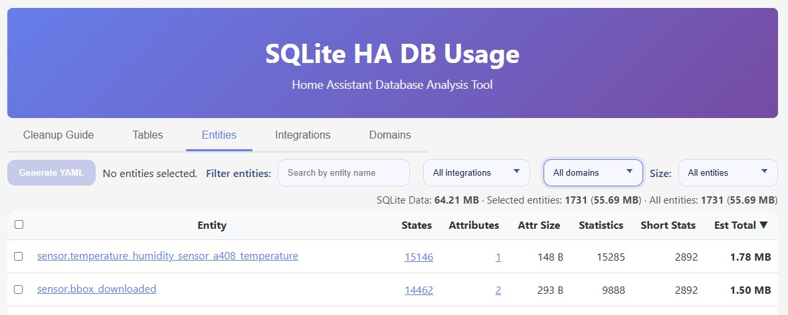

# HA DB Usage - Home Assistant Database Analysis Add-on

A lightweight web UI addon to inspect Home Assistant recorder database usage, providing insights into disk space consumption by tables and entities, along with database cleanup guidance. It works only for SQLite databases.

> [!NOTE]
> This addon was vibe-coded for most part with Github Copilot. I reviewed and tested for my personal use, but not sure I will maintain it.


## Features

- 🧹 **Cleanup Guide**: Step-by-step instructions for database maintenance and optimization
- 📊 **Table Analysis**: View actual SQLite file size, table sizes, indexes, metadata, and data-only totals
- 🔍 **Entity Insights**: Analyze entity storage with filters, pagination, estimated size, total estimated entity size, and data-only totals
- 🔌 **Integration & Domain Summary**: Group entity storage by integration and domain, showing percent of total data use
- 🏠 **Home Assistant Integration**: Direct links to history and developer tools




## Installation

### Install via HACS (Recommended)

[](https://my.home-assistant.io/redirect/supervisor_add_addon_repository/?repository_url=https%3A%2F%2Fgithub.com%2Frpeyron%2Fha-dbusage)

Or manually:
1. Go to **Home Assistant Settings → Add-ons & Automations → Add-ons**
2. Click the **Create add-on button** (three dots in bottom right)
3. Add this custom repository URL `https://github.com/rpeyron/ha-dbusage`
4. Look for **SQLite HA DB Usage** in the add-ons list
5. Click **Install**
6. Click **Start** to launch the add-on
7. Access the UI at by clicking on the button "Open Web interface" on the App page

### Manual Installation

1. Clone or download this repository
2. Copy the add-on directory to `~/.homeassistant/addons/ha-dbusage/`
3. Go to **Settings → Add-ons → Create add-on**
4. Search for **DB Insights** and install
5. Start the add-on


### Local Installation

You can also run this tool locally outside your Home Assistant instance:
1. Clone or download this repository
2. Copy your `/config/home-assistant_v2.db` database (mandatory) and `/config/.storage/core.entity_registry` registry (optional but recommended) in `data/`
3. Run `npm run dev`


## Usage

1. **Analyze your database**: Check the Tables, Entities, Integrations, and Domains tabs to identify what's consuming space
2. **Generate recorder config**: Use the **Generate YAML** buttons in Entities and Domains tabs to help configure exclusions
3. **Follow cleanup guide**: Visit the Cleanup tab for detailed instructions on optimizing your database

## Development

```bash
npm run generate-db   # Create sample SQLite database
npm run dev           # Build and run with watch mode
npm run build         # Compile TypeScript
npm start             # Run compiled server
npm test              # Run smoke tests
```

- `DB_PATH`: Path to the Home Assistant database (default: `./data/home-assistant_v2.db`)
- `HOME_ASSISTANT_URL`: Optional Home Assistant base URL for building direct links

There is also a devcontainer available